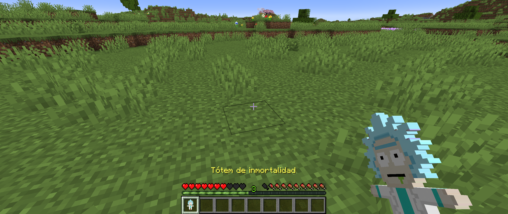
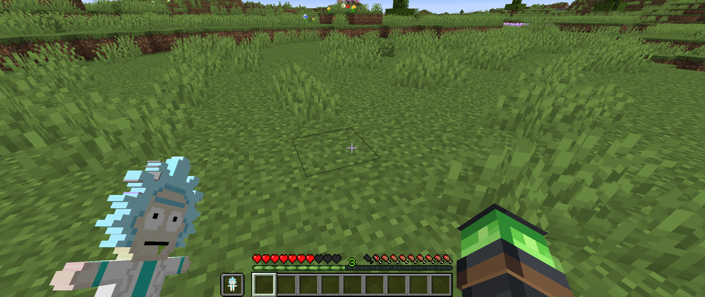
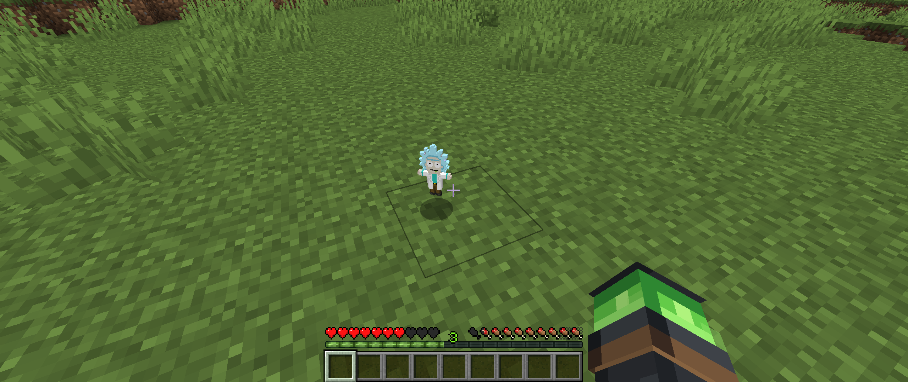
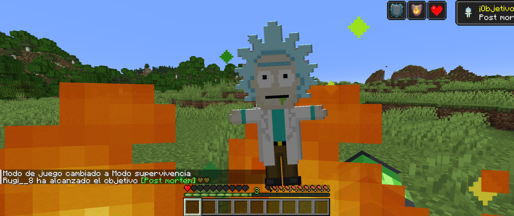

# Rick Totem Resource Pack



Resource pack para **Minecraft Java Edition 1.21** que sustituye la textura del **Tótem de la Inmortalidad** por una versión pixel art de Rick.







## Compatibilidad

- Minecraft Java Edition 1.21 y 1.21.1.
- `pack_format`: 34.
- No requiere OptiFine ni otros mods.
- Puede utilizarse en mundos individuales y servidores que permitan resource packs locales.

## Contenido

- `pack.mcmeta`: metadatos y compatibilidad del pack.
- `pack.png`: icono y vista previa.
- `assets/minecraft/textures/item/totem_of_undying.png`: textura del tótem en formato PNG RGBA de 128 × 128 píxeles.

## Instalación

1. Descarga el ZIP publicado en la sección **Releases** o utiliza la carpeta del repositorio.
2. Copia el ZIP o la carpeta en:

   ```text
   %APPDATA%\.minecraft\resourcepacks
   ```

3. Abre Minecraft.
4. Ve a **Opciones → Paquetes de recursos**.
5. Activa **Rick Totem para Minecraft Java 1.21**.

Si Minecraft ya estaba abierto, recarga los recursos con `F3 + T`.

## Crear un ZIP instalable

Desde la raíz del repositorio, después de crear un commit:

```bash
git archive --format=zip --output Rick_Totem_ResourcePack_1.21.zip HEAD
```

El ZIP resultante tendrá `pack.mcmeta`, `pack.png` y `assets/` directamente en su raíz, como exige Minecraft. No comprimas la carpeta contenedora completa: si `pack.mcmeta` queda dentro de una subcarpeta, Minecraft no reconocerá correctamente el pack.

## Estructura

```text
Rick_Tótem_ResourcePack_1.21/
├── assets/
│   └── minecraft/
│       └── textures/
│           └── item/
│               └── totem_of_undying.png
├── pack.mcmeta
├── pack.png
└── README.md
```

## Personalización

Para sustituir el diseño, reemplaza `totem_of_undying.png` por otro PNG cuadrado con transparencia y conserva exactamente el mismo nombre y ruta.
